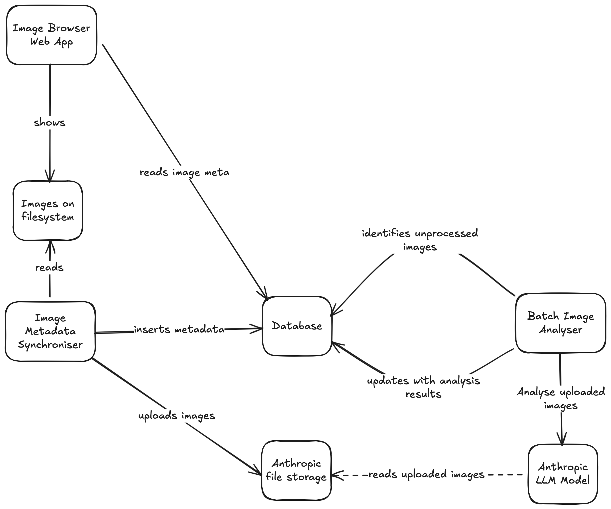

# Overview
I want to build a photograph analysing tool application. The tool analyse the qualify of the photograph using the common criteria used by professional photography critics. I think the following criteria should be used but am open to suggestions:
- composition (0-10): framing, rule of thirds, balance, leading lines
- lighting (0-10): exposure, shadows, highlights, contrast
- color_and_tone (0-10): white balance, harmony, saturation
- subject_storytelling (0-10): emotion, sense of place, narrative
- technical_execution (0-10): focus, sharpness, noise, clarity
- overall_impact (0-10): memorability, mood, travel appeal

The analyser tool should also provide the following extra details:
- a short comment to justify its analysis of the image.
- caption of the image
- up to 10 keywords for the image

The app is divided into 2 major components: frontend and backend.

# Backend
The backend of the application is responsible for analyse photographs in a specific directory on the filesystem. There are 2 modules in the backend component: Image Metadata Synchroniser and Batch Image Analyser.

## Image Metadata Synchroniser
The Image Metadata Synchroniser (IMS) detects new / updated images in a specific directory and extract and store metadata of the images into the database.

### Workflow
1. scan new / updated images in specific directory for initial metadata 
2. store metadata in database
3. upload images to Anthropic file storage
4. update database with Anthropic file id

To save cost, the image should be resized to no larger than 800x800 resolution with medium jpeg compression before uploading to Anthropic file storage. The original image must not be modified.

## Batch Image Analyser
The Batch Image Analyser (BIA) scans database for uploaded but unprocessed images. Each of these images is sent to Anthropic LLM for analysis. To save cost, the BIA should use Anthropic's Message Batches API to submit requests and poll for analysis results.

### Workflow
1. scan database for uploaded and unprocessed images
2. use and AI agent powered by Anthropic LLM to analyse the image in batch mode
3. store analysis result of the image in database when analysis of each image is completed

## Database Schema
The database schema should include the following essential fields:
- full_path_filename: full path filename of the image
- upload_file_id: file id returned by Anthropic file storage after uploading
- processed: whether the image has been processed
- analysis_result: serialised JSON object of the image analysis result

# Frontend
A locally-hosted simple web app that shows images and metadata stored in database.

# High Level Tech Stack
This app is expected to use Anthropic SDK to interact with Anthropic service. The Anthropic SDK supports Typescript and Python. Since this app has both backend and frontend component, I suggest we use Typescript for both components. 

This app is expected to run locally in the MVP version. I suggest we use SQLite as storage.

# Priority
Build a functioning backend before the frontend.

# References
- Anthropic Agent SDK: https://platform.claude.com/docs/en/agent-sdk/overview
- Batch processing: https://platform.claude.com/docs/en/build-with-claude/batch-processing
- Vision: https://platform.claude.com/docs/en/build-with-claude/vision
- Files API: https://platform.claude.com/docs/en/build-with-claude/files